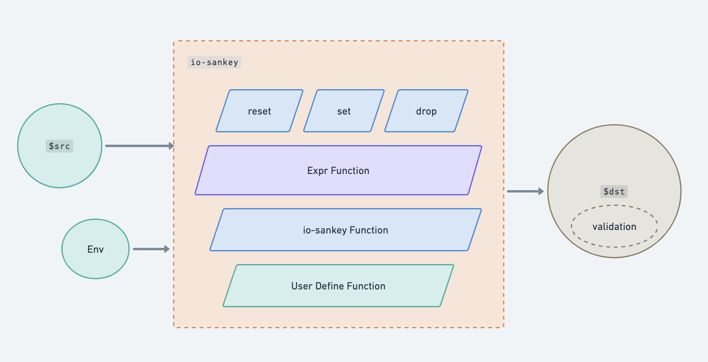

<!-- Improved compatibility of back to top link: See: https://github.com/RealAlexandreAI/io-sankey/pull/73 -->
<a name="readme-top"></a>
<!--
*** Thanks for checking out the Best-README-Template. If you have a suggestion
*** that would make this better, please fork the repo and create a pull request
*** or simply open an issue with the tag "enhancement".
*** Don't forget to give the project a star!
*** Thanks again! Now go create something AMAZING! :D
-->


<!-- PROJECT SHIELDS -->
<!--
*** I'm using markdown "reference style" links for readability.
*** Reference links are enclosed in brackets [ ] instead of parentheses ( ).
*** See the bottom of this document for the declaration of the reference variables
*** for contributors-url, forks-url, etc. This is an optional, concise syntax you may use.
*** https://www.markdownguide.org/basic-syntax/#reference-style-links
-->
[![Contributors][contributors-shield]][contributors-url]
[![Forks][forks-shield]][forks-url]
[![Stargazers][stars-shield]][stars-url]
[![Issues][issues-shield]][issues-url]
[![GPL License][license-shield]][license-url]


<!-- PROJECT LOGO -->
<br />
<div align="center">
  <a href="https://github.com/RealAlexandreAI/io-sankey">
    
  </a>

<h3 align="center">io-sankey</h3>

  <p align="center">
    Framework for IO mapping and validation across heterogeneous data.
    <br />
    <a href="https://goplay.tools/snippet/Xr04C_wjVeB">Online Playground</a>
    ·
    <a href="https://github.com/RealAlexandreAI/io-sankey/issues/new?labels=bug&template=bug-report---.md">Report Bug</a>
    ·
    <a href="https://github.com/RealAlexandreAI/io-sankey/issues/new?labels=enhancement&template=feature-request---.md">Request Feature</a>
  </p>
</div>


<!-- ABOUT THE PROJECT -->
## 🧶 Framework for IO mapping and validation across heterogeneous data.

### 🌟 Reasons to Choose io-sankey

- 🧩 Modularity and Scalability: Designed with a modular approach and scalability in mind, io-sankey allows users to flexibly add or swap out data processing components to align with their workflow and project needs. It's an ideal tool for both novices and seasoned professionals looking to extend functionality for specific data transformation and validation requirements.

- 🔌 Seamless Data Conversion: Easily integrate io-sankey into your data pipeline for on-the-fly conversion, supporting a variety of data formats to ensure smooth data flow through your system.

- 📏 Accurate Data Validation: With a focus on precision, io-sankey offers stringent data validation features to ensure that only the most accurate and reliable data is processed and passed along.

- 📚 Extensive Function Library: Boasting an extensive library of functions derived from the expr library, io-sankey provides robust support for a wide array of data manipulation tasks. The library is complemented by built-in functions within io-sankey and the flexibility to pass custom user functions at runtime, catering to specific data processing needs.

- 👶 User-Friendly for Beginners, Feature-Rich for Experts: io-sankey strikes a balance between ease of use and advanced capabilities. New users can quickly get started with its intuitive interface, while more experienced users can leverage its advanced features for complex data operations.

### Intro

 

The quintessential objective is to morph the $src entity into an alternate structure. transmute it into a distinct JSON Object (map[string]any).

Hence, the fundamental constituents can be distilled into the following:

- Immutable Data
    - User Input: Referring to $src
    - Environment (Env): The dataset anticipated for runtime interrogation
- Transformation Expression
  - The core io-sankey functions
    - reset()
    - set("key", "value")
    - drop("key")
  - The `expr` builtin function & operators
  - The io-sankey's intrinsic functions
  - Custom user-defined functions: Injected at runtime
- Verification 

<!-- USAGE EXAMPLES -->
## Usage

### Example

```go
var srcData = MixedDataTypes{
	IntValue:    42,
	FloatValue:  3.14,
	StringValue: "Hello, World!",
	BoolValue:   true,
	ArrayValue:  [3]int{1, 2, 3},
	SliceValue:  make([]int, 0, 5),
	MapValue:    map[string]int{"one": 1, "two": 2},
	IntPtrValue: func() *int { var temp int = 100; return &temp }(),
	StructValue: struct {
		Name string
		Age  int
	}{"Alice", 30},
}

```


```go
st := NewSankeyTransformer(
	WithExpressions(
		"reset()",
		`set("name", "Tom")`,
		`set("friend.last", "Anderson")`,
		`drop("name")`,
		`set("keyFromSrc", $src.StructValue)`,
		`set("keyFromExternalEnv", $externalKey)`,
		`set($externalKey, externalKey)`,
		`set("KeyBuiltinFunc", uuidv4())`,
		`set("KeyCustomFunc", myToInt(paramStringInt))`,
	),
	WithEnvs(map[string]interface{}{
		"$externalKey":   "eValue1",
		"externalKey":    "eValue2",
		"paramStringInt": "123",
	}),
	WithExprOptions(
		expr.Function(
			"myToInt",
			func(params ...any) (any, error) {
				return strconv.Atoi(params[0].(string))
			},
			new(func(string) int),
		),
	),
)

st.Map(srcData)

```

### Explanation


| **Action**                                      | **Related Resource**                   | **Interim Results (dst)**                                                                                                                                                                            |
|-------------------------------------------------|---------------------------------------------------|------------------------------------------------------------------------------------------------------------------------------------------------------------------------------------------------------|
| `.Map` Or `.Transform`                          | $src, copy $src to dst by default.                | $src == mixedData == dst                                                                                                                                                                             |   
| `reset()`                                       | Discard attributes inherited from $src.           | { }                                                                                                                                                                                                  |   
| `set("name", "Tom")`                            | use `sjson` grammer to set                        | `{"name":"Tom"}`                                                                                                                                                                                     |   
| `set("friend.last", "Anderson")`                | use `sjson` grammer to set deeper field           | `{"name":"Tom","friend":{"last":"Anderson"}}`                                                                                                                                                        |   
| `drop("name")`                                  | use `sjson` grammer to delete                     | `{"friend":{"last":"Anderson"}}`                                                                                                                                                                     |   
| `set("keyFromSrc", $src.StructValue)`           | user input $src as a datasource to fill value     | `{"friend":{"last":"Anderson"},"keyFromSrc":{"Name":"Alice","Age":30}}`                                                                                                                              |   
| `set("keyFromExternalEnv", $externalKey)`       | user input Env as a datasource to fill value      | `{"friend":{"last":"Anderson"},"keyFromSrc":{"Name":"Alice","Age":30},"keyFromExternalEnv":"eValue1"}`                                                                                               |   
| `set($externalKey, externalKey)`                | expression as key and value                       | `{"friend":{"last":"Anderson"},"keyFromSrc":{"Name":"Alice","Age":30},"keyFromExternalEnv":"eValue1","eValue1":"eValue2"}`                                                                           |   
| `set("KeyBuiltinFunc", uuidv4())`               | use io-sankey Function (expr Function same way )  | `{"friend":{"last":"Anderson"},"keyFromSrc":{"Name":"Alice","Age":30},"keyFromExternalEnv":"eValue1","eValue1":"eValue2","KeyBuiltinFunc":"41b078ce-b81f-4972-ae80-5a0d385247fa"}`                   |   
| `set("KeyCustomFunc", myToInt(paramStringInt))` | use user defined Function                         | `{"friend":{"last":"Anderson"},"keyFromSrc":{"Name":"Alice","Age":30},"keyFromExternalEnv":"eValue1","eValue1":"eValue2","KeyBuiltinFunc":"41b078ce-b81f-4972-ae80-5a0d385247fa","KeyCustomFunc":123}` | 
| `.Map` Or `.Transform`                          | Map() finish here. Transform() validate & deserialize. |                                                                                                                                                                                                      | 


<!-- GETTING STARTED -->
## 🏁 Getting Started
To add the io-sankey to your Go project, use the following command:

```shell
go get github.com/RealAlexandreAI/io-sankey
```

```go

// Map
// @Description: Map a JSON Object to map[string]any through expressions.
func (s *SankeyTransformer) Map(src any) (map[string]any, error) 

// Transform
//@Description: Transform a JSON Object to another one through expressions
func (s *SankeyTransformer) Transform(src any, dst any) error

```


### Env

You can place any data into the runtime context in the form of WithEnvs(), but there are two reserved keywords, `$src` and `$dst`, whose contents as keys will be overridden by io-sankey.

### Core Function

#### reset()

The default behavior of io-sankey is that `$dst` inherits all properties of `$src`. If you wish to discard the automatically inherited content within an expression, then use `reset()`.

#### set("key","value") & drop("key")

refer [sjson Set](https://github.com/tidwall/sjson)

Compared to the `Set` method in sjson, the set method in io-sankey automatically places `$dst` into the pending processing section.


### Expr Function

refer [Expr Operator & Function](https://github.com/expr-lang/expr/blob/master/docs/language-definition.md)

### io-sankey Intrinsic Function

- `uuidv4() stirng`
- `jsonrepair(string) string`


### Validation

refer [validator v10](https://github.com/go-playground/validator)

io-sankey `Transform` validate dst by validator tags automaticly.


<!-- ROADMAP -->
## Roadmap

- [x] Basic feature
- [ ] Enhance Doc & test cases
- [ ] More functions like sprig
- [ ] Guiding IO structuring, similar to Outlines from dottxt


See the [open issues](https://github.com/RealAlexandreAI/io-sankey/issues) for a full list of proposed features (and known issues).

<p align="right">(<a href="#readme-top">back to top</a>)</p>


<!-- CONTRIBUTING -->
## Contributing

Contributions are what make the open source community such an amazing place to learn, inspire, and create. Any contributions you make are **greatly appreciated**.

If you have a suggestion that would make this better, please fork the repo and create a pull request. You can also simply open an issue with the tag "enhancement".
Don't forget to give the project a star! Thanks again!

1. Fork the Project
2. Create your Feature Branch (`git checkout -b feature/AmazingFeature`)
3. Commit your Changes (`git commit -m 'Add some AmazingFeature'`)
4. Push to the Branch (`git push origin feature/AmazingFeature`)
5. Open a Pull Request

<p align="right">(<a href="#readme-top">back to top</a>)</p>

<!-- LICENSE -->
## License

Distributed under the GPLv3 License. See `LICENSE` for more information.

<p align="right">(<a href="#readme-top">back to top</a>)</p>


<!-- CONTACT -->
## Contact

RealAlexandreAI - [@RealAlexandreAI](https://twitter.com/RealAlexandreAI)

Project Link: [https://github.com/RealAlexandreAI/io-sankey](https://github.com/RealAlexandreAI/io-sankey)

<p align="right">(<a href="#readme-top">back to top</a>)</p>


<!-- MARKDOWN LINKS & IMAGES -->
<!-- https://www.markdownguide.org/basic-syntax/#reference-style-links -->
[contributors-shield]: https://img.shields.io/github/contributors/RealAlexandreAI/io-sankey.svg?style=for-the-badge
[contributors-url]: https://github.com/RealAlexandreAI/io-sankey/graphs/contributors
[forks-shield]: https://img.shields.io/github/forks/RealAlexandreAI/io-sankey.svg?style=for-the-badge
[forks-url]: https://github.com/RealAlexandreAI/io-sankey/network/members
[stars-shield]: https://img.shields.io/github/stars/RealAlexandreAI/io-sankey.svg?style=for-the-badge
[stars-url]: https://github.com/RealAlexandreAI/io-sankey/stargazers
[issues-shield]: https://img.shields.io/github/issues/RealAlexandreAI/io-sankey.svg?style=for-the-badge
[issues-url]: https://github.com/RealAlexandreAI/io-sankey/issues
[license-shield]: https://img.shields.io/github/license/RealAlexandreAI/io-sankey.svg?style=for-the-badge
[license-url]: https://github.com/RealAlexandreAI/io-sankey/blob/master/LICENSE
[product-screenshot]: images/screenshot.png


